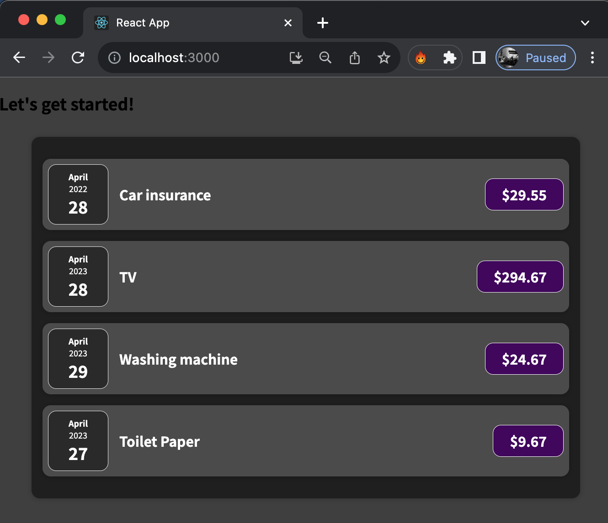

## Simple React JS Project

So I started learning React from free videos on youtube, and I noticed that my JS was a bit lacking, so the next logical step was to find a course that would offer more than an immediate answer. I like setting up a really good foundation. 

I've built this project in order to practice React basic building blocks, such as Composition, wrappers, working with properties and basic JS: destructuring, decomposition, the spread operator and calling various functions. Much of the work was done by following along [This Course on Udemy](https://www.udemy.com/course/react-the-complete-guide-incl-redux/).

Some really cool stuff future me may find in here: 
- object composition, a bit more than a hello world
- how to create a wrapper Card function and how to adopt it in a project
- playing around with css and calendars

The app looks like an Expense Tracking app, however the interface is not yet interactive - none of the buttons are clickable.

### Expense tracking app
 

### How to... 
- run the app: `npm start` will do everything 
- run tests: you can't run something that doesn't exist. Not sure why jest is here though, I'll just leave it there for now. 
- useful documentation - [my page with links on Array Functions in JavaScript](arrayFunctions.md)

